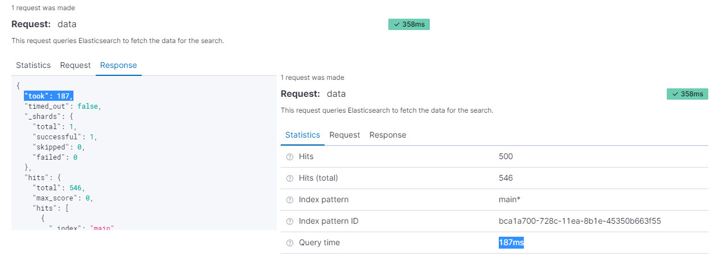
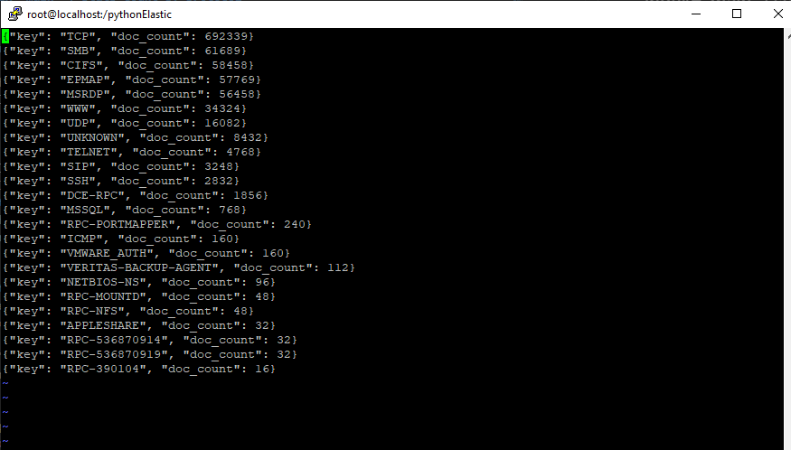
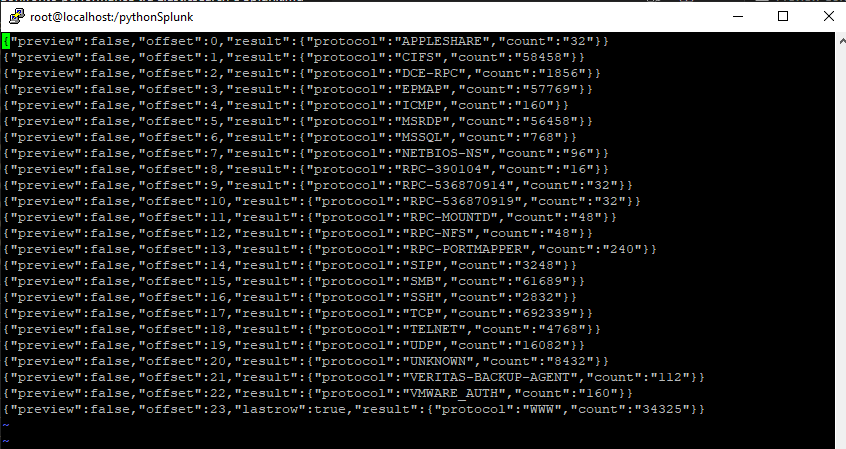

# Confronto performance tra Elasticsearch e Splunk

## Riferimenti
- [Guida setup Elasticsearch-Kibana-Logstash](https://github.com/anthonypope95/elasticsearch/blob/master/ElasticGuide.md)

- [Installazione Splunk su CentOS](https://www.bitsioinc.com/tutorials/install-splunk-centos/)

---

## Specifiche tecniche del sistema utilizzato

### CPU

```
[root@localhost ~]# lscpu
Architecture:          x86_64
CPU op-mode(s):        32-bit, 64-bit
Byte Order:            Little Endian
CPU(s):                2
On-line CPU(s) list:   0,1
Thread(s) per core:    1
Core(s) per socket:    1
Socket(s):             2
NUMA node(s):          1
Vendor ID:             GenuineIntel
CPU family:            6
Model:                 85
Model name:            Intel(R) Xeon(R) Silver 4214 CPU @ 2.20GHz
Stepping:              7
CPU MHz:               2194.844
BogoMIPS:              4389.68
Hypervisor vendor:     VMware
Virtualization type:   full
L1d cache:             32K
L1i cache:             32K
L2 cache:              1024K
L3 cache:              16896K
NUMA node0 CPU(s):     0,1
```

### RAM 

```
[root@localhost ~]# sudo dmidecode -t 16
# dmidecode 3.2
Getting SMBIOS data from sysfs.
SMBIOS 2.7 present.

Handle 0x0028, DMI type 16, 23 bytes
Physical Memory Array
        Location: System Board Or Motherboard
        Use: System Memory
        Error Correction Type: None
        Maximum Capacity: 9 GB
        Error Information Handle: Not Provided
        Number Of Devices: 64
```

### Disco

```
[root@localhost ~]# df
File system             1K-blocchi   Usati Disponib. Uso% Montato su
devtmpfs                   3992720       0   3992720   0% /dev
tmpfs                      4004704       0   4004704   0% /dev/shm
tmpfs                      4004704   75540   3929164   2% /run
tmpfs                      4004704       0   4004704   0% /sys/fs/cgroup
/dev/mapper/centos-root   24105472 5589840  18515632  24% /
/dev/sda1                  1038336  152512    885824  15% /boot
/dev/mapper/centos-opt    50455204 3399972  47055232   7% /opt
tmpfs                       800944       0    800944   0% /run/user/0
```

### Sistema Operativo

```
[root@localhost ~]# cat /etc/*release
CentOS Linux release 7.7.1908 (Core)
NAME="CentOS Linux"
VERSION="7 (Core)"
ID="centos"
ID_LIKE="rhel fedora"
VERSION_ID="7"
PRETTY_NAME="CentOS Linux 7 (Core)"
ANSI_COLOR="0;31"
CPE_NAME="cpe:/o:centos:centos:7"
HOME_URL="https://www.centos.org/"
BUG_REPORT_URL="https://bugs.centos.org/"

CENTOS_MANTISBT_PROJECT="CentOS-7"
CENTOS_MANTISBT_PROJECT_VERSION="7"
REDHAT_SUPPORT_PRODUCT="centos"
REDHAT_SUPPORT_PRODUCT_VERSION="7"

CentOS Linux release 7.7.1908 (Core)
CentOS Linux release 7.7.1908 (Core)
```
---

## Fase Pre-Test

#### Sono stati caricati all'interno di Elasticsearch degli oggetti JSON prelevati da un file data.json
#### Di seguito viene riportato il contenuto del file di configurazione di Logstash utilizzato per il caricamento dei dati all'interno di Elasticsearch.

```
input {
    
    file {
        type => "json"
        path => "/home/data.json"
        start_position => "beginning"
        codec => "json"
    }
}

filter {
    
    json {
        source => "message"
    }
}

output {
    
    stdout { codec => rubydebug }

    elasticsearch{      
        hosts => ["ip_elastic_host:9200"]
        index => ["main"]
        document_type => "json"
    }
}

```

#### Il medesimo file data.json è stato caricato all'interno di Splunk utilizzando l'interfaccia grafica presente all'indirizzo http://ip_splunk_host:8000


### Totale numero eventi presenti nel file data.json : 62.206

### Nota: i test delle performance sono stati eseguiti utilizzando (mantenendo attivo) un servizio per volta (Elasticsearch e Kibana / Splunk).
### È stata utilizzata una configurazione di Elasticsearch di tipo single node.


---

## Testing

### Test 1

### Query Splunk utilizzata: 
> index="main" port=8080
#### Risultato: This search has completed and has returned 242 risultati by scanning 284 events in 0,08 seconds

### Query Elasticsearch utilizzata: 

>_index:"main" AND port:8080


#### Risultato:
#### The total time the request took: 688 ms = 0.688 s
#### Query time: 220 ms = 0.220 s
#### Total hits: 242

---

### Test 2

### Query Splunk utilizzata: 
> index="main" port=80 AND pluginname="Nessus SYN scanner"
#### Risultato: This search has completed and has returned 776 risultati by scanning 1.085 events in 0,154 seconds

### Query Elasticsearch utilizzata:

> _index:"main" AND port:80 AND pluginname:"Nessus SYN scanner"

#### Risultato:
#### The total time the request took: 1235 ms = 1.235 s
#### Query time: 639 ms = 0.639 s
#### Total hits: 776

---

### Test 3

### Query Splunk utilizzata: 
> index="main" AND connectorname=NESSUS_B AND protocol=TCP AND port=80

#### Risultato: This search has completed and has returned 631 risultati by scanning 866 events in 0,144 seconds

### Query Elasticsearch utilizzata:
>_index:"main" AND connectorname:NESSUS_B AND protocol:TCP AND port:80

#### Risultato:
#### The total time the request took: 991 ms = 0.991 s
#### Query time: 524 ms = 0.524 s
#### Total hits: 631

---

### Test 4 


### Query Splunk utilizzata: 
> index="main" AND protocol=UDP AND connectorname=TenableAlfa

#### Risultato: This search has completed and has returned 546 risultati by scanning 546 events in 0,125 seconds


### Query Elasticsearch utilizzata:
> _index:"main" AND protocol:UDP AND connectorname:TenableAlfa

#### Risultato:
#### The total time the request took: 734 ms = 0.734 s
#### Query time: 246 ms = 0.246 s
#### Total hits: 546


---

*Query Time: non include il tempo impiegato per spedire la richiesta o per parsarla nel browser.*

---

# Incremento prestazioni Elasticsearch

## Riferimenti

- [ELASTICSEARCH: OPTIMIZATION GUIDE](https://octoperf.com/blog/2018/09/21/optimizing-elasticsearch/)

---
### Disable Swap File

Al fine di migliorare le prestazioni di Elasticsearch si raccomanda di disabilitare lo swap

> sudo swapoff -a

Recarsi infine nel seguente file e commentare le righe relative allo swap

> vi /etc/fstab

---

### Lasciare abbastanza memoria per buff/cache

```
[root@localhost elasticsearch]# free -m
              total        used        free      shared  buff/cache   available
Mem:           7821        5141         325         212        2354        1901
Swap:             0           0           0
```

La memoria disponibile è di 7821 MB mentre quella in uso è 5141 MB


---

### Assicurarsi di avere una corretta mappatura dell'indice

Assicurarsi di avere impostato il type keyword, adatto quando è necessario cercare documenti abbinando esattamente il valore fornito

```
{
  "main" : {
    "mappings" : {
      "properties" : {
        "@timestamp" : {
          "type" : "date"
        },
        "@version" : {
          "type" : "text",
          "fields" : {
            "keyword" : {
              "type" : "keyword",
              "ignore_above" : 256
            }
          }
        },
        "connectorname" : {
          "type" : "text",
          "fields" : {
            "keyword" : {
              "type" : "keyword",
              "ignore_above" : 256
            }
          }
        },
  ...
  ...
``` 

---
### Ottimizza l'intervallo di aggiornamento (index.refresh_interval)

L'intervallo di aggiornamento predefinito è 1s, il che significa che ogni secondo, tutti i nuovi documenti aggiunti saranno disponibili per la ricerca.
Aumentare questo intervallo a 30 secondi.

Query eseguita in Kibana
``` 
PUT /main/_settings
 {
    "index" : {
        "refresh_interval" : "30s"
    }
    
 }
```
---
### Evitare lo swapping

Lo swapping nei nodi di elasticsearch vengono controllati dalla proprietà bootstrap.memory_lock

Più c'è swapping e maggiore il processo risulterà lento.

Recarsi nel file 

> vi /etc/elasticsearch/elasticsearch.yml

e impostare la proprietà bootstrap.memory_lock su true 

Per migiorare ulteriormente le prestazioni recarsi nel file di configurazione 

>  vi /etc/sysconfig/elasticsearch 

e rendere disponibile sufficiente ES_HEAP_SIZE  

---

### Controllare processori rilevati e processori allocati


Eseguire la seguente query in Kibana

> GET _nodes/os

Restituirà il seguente output

```
...
...

   "os" : {
        "refresh_interval_in_millis" : 1000,
        "name" : "Linux",
        "pretty_name" : "CentOS Linux 7 (Core)",
        "arch" : "amd64",
        "version" : "3.10.0-1062.el7.x86_64",
        "available_processors" : 2,
        "allocated_processors" : 2
      }
    }
  }
}
```

---

## Testing 

### Test 1

### Query Elasticsearch utilizzata: 

>_index:"main" AND port:8080


#### Risultato:
#### The total time the request took: 577 ms = 0.577 s
#### Query time: 94 ms = 0.940 s
#### Total hits: 242

---

### Test 2

### Query Elasticsearch utilizzata:

> _index:"main" AND port:80 AND pluginname:"Nessus SYN scanner"

#### Risultato:
#### The total time the request took: 1256 ms = 1.256 s
#### Query time: 585 ms = 0.585 s
#### Total hits: 776

---

### Test 3

### Query Elasticsearch utilizzata:
>_index:"main" AND connectorname:NESSUS_B AND protocol:TCP AND port:80

#### Risultato:
#### The total time the request took: 956 ms = 0.956 s
#### Query time: 329 ms = 0.329 s
#### Total hits: 631

---

### Test 4


### Query Elasticsearch utilizzata:
> _index:"main" AND protocol:UDP AND connectorname:TenableAlfa

#### Risultato:
#### The total time the request took: 772 ms = 0.772 s
#### Query time: 255 ms = 0.255 s
#### Total hits: 546

---

## Testing cache 

Riesecuzione dei test per verificare l'efficienza della cache

### Test 1

### Query Elasticsearch utilizzata: 

>_index:"main" AND port:8080


#### Risultato:
#### The total time the request took: 663 ms = 0.663 s
#### Query time: 41 ms = 0.41 s
#### Total hits: 242

---

### Test 2

### Query Elasticsearch utilizzata:

> _index:"main" AND port:80 AND pluginname:"Nessus SYN scanner"

#### Risultato:
#### The total time the request took: 887 ms = 0.887 s
#### Query time: 221 ms = 0.221 s
#### Total hits: 776

---

### Test 3

### Query Elasticsearch utilizzata:
>_index:"main" AND connectorname:NESSUS_B AND protocol:TCP AND port:80

#### Risultato:
#### The total time the request took: 858 ms = 0.858 s
#### Query time: 273 ms = 0.273 s
#### Total hits: 631

---

### Test 4


### Query Elasticsearch utilizzata:
> _index:"main" AND protocol:UDP AND connectorname:TenableAlfa

#### Risultato:
#### The total time the request took: 809 ms = 0.809 s
#### Query time: 189 ms = 0.189 s
#### Total hits: 546

---


# Query Splunk using Python 

## Script Python utilizzato


```python
import requests
import time


data2 = {
       'search': 'search index="main" port=80  pluginname="Nessus SYN scanner"',
       'output_mode': 'json'
     }

now = time.time()
response = requests.post('https://10.10.10.52:8089/servicesNS/admin/search/search/jobs/export', data=data2, verify=False, auth=('admin', 'password'))
now2 = time.time()
full_time = now2 - now
print("full query time (s): ")
print(full_time)

print(response)

with open ('out.json', 'w', encoding="utf-8") as result:
   result.write(response.text)
```

L'output contenente i JSON Object (risultato della query) viene inserito nel file out.json

La request avvia un JOB le cui info sono accessibili al seguente link: https://10.10.10.52:8089/servicesNS/admin/search/search/jobs


---

# Query Elasticsearch using Python

## Script Python utilizzato

```python
from elasticsearch import Elasticsearch
import json
import time

es = Elasticsearch(
    ['localhost', '10.10.10.52'],
    http_auth=('elastic', 'password'),
    scheme="http",
    port=9200,
)

now = time.time()
res = es.search(index="main", body={"query": { "bool": { "must": [  {"match": {"protocol":"UDP"}}, {"match": {"connectorname":"TenableAlfa"}}, ]  }   }},size=600)
now2 = time.time()
full_time = now2 - now
print("full query time (s): ")
print(full_time)

#print("queryTime: ",res['took'] )
print("Got %d Hits:" % res['hits']['total']['value'])

#i = 0

with open ('out.json', 'w', encoding="utf-8") as result:
    for hit in res['hits']['hits']:
        #print(hit,'\n')
        result.write(json.dumps(res['hits']['hits']))
        result.write('\n')
        #result.write(str(i))
        #i+=1

print("queryTime:",res["took"])
```

L'output contenente i JSON Object (risultato della query) viene inserito nel file out.json

res["took"] rappresenta il Query Time



---

# Confronto Performance Splunk/Elasticsearch eseguendo le query con script Python

Nota: Full execution query time tiene conto anche dei tempi per l'invio della richiesta e per la ricezione della risposta

### **Test1:** index="main" port=8080


|                          | Splunk               | Elasticsearch (no tuning)    | Elasticsearch (tuning)  |
| -------------------------|:--------------------:|-----------------------------:|------------------------:|
| Query time(ms)           | 46                   | 29                           | 30                      |
| Full execution query(ms) | 232,22               | 139,00                       | 165,00                  |


### **Test2:** index="main" port=80 AND pluginname="Nessus SYN scanner"

|                          | Splunk               | Elasticsearch (no tuning)    | Elasticsearch (tuning)  |
|--------------------------|:--------------------:|-----------------------------:|------------------------:|
| Query time(ms)           | 126                  | 96                           | 88                      |
| Full execution query(ms) | 309,71               | 227,26                       | 218,24                  |


### **Test3:** index="main" AND connectorname=NESSUS_B AND protocol=TCP AND port=80

|                          | Splunk               | Elasticsearch (no tuning)    | Elasticsearch (tuning)  |
|--------------------------|:--------------------:|-----------------------------:|------------------------:|
| Query time(ms)           | 45                   | 54                           | 68                      |
| Full execution query(ms) | 216,70               | 177,48                       | 193,23                  |


### **Test4:** index="main" AND protocol=UDP AND connectorname=TenableAlfa

|                          | Splunk               | Elasticsearch (no tuning)    | Elasticsearch (tuning)  |
|--------------------------|:--------------------:|-----------------------------:|------------------------:|
| Query time(ms)           | 41                   | 48                           | 56                      |
| Full execution query(ms) | 254,36               | 205,29                       | 187,41                  |


---

# Incremento del DB a 1.000.000 di elementi

## Script Python utilizzato

```python
import json
import time

def main():
    f2 = open("testSplunkEsteso.json","a")
    max = 1000000
    i = 0

    while i < max: 
        f = open("testSplunk.json","r")
        b = f.readline()
        while (b):
            if i >= max:
                break
            else:
                line_dict = json.loads(b)
                line_dict['ts'] = time.time() * 1000  # convertito in millisecondi
                line_json = json.dumps(line_dict)
                f2.write(line_json)
                f2.write('\n')
                b = f.readline()
                i+=1

        f.close()
    f2.close()


main()
```
---

# Confronto Performance Splunk/Elasticsearch eseguendo le query con script Python (su DB esteso)


### **Test1:** index="main" port=8080


|                          | Splunk               | Elasticsearch (no tuning)    | Elasticsearch (tuning)  |
| -------------------------|:--------------------:|-----------------------------:|------------------------:|
| Full execution query(ms) | 504,29               | 246,09                       | 298,74                  |


### **Test2:** index="main" port=80 AND pluginname="Nessus SYN scanner"


|                          | Splunk               | Elasticsearch (no tuning)    | Elasticsearch (tuning)  |
| -------------------------|:--------------------:|-----------------------------:|------------------------:|
| Full execution query(ms) | 837,49               | 526,40                       | 490,25                  |


### **Test3:** index="main" AND connectorname=NESSUS_B AND protocol=TCP AND port=80


|                          | Splunk               | Elasticsearch (no tuning)    | Elasticsearch (tuning)  |
| -------------------------|:--------------------:|-----------------------------:|------------------------:|
| Full execution query(ms) | 654,71               | 437,94                       | 274,87                  |


### **Tes4:** index="main" AND protocol=UDP AND connectorname=TenableAlfa


|                          | Splunk               | Elasticsearch (no tuning)    | Elasticsearch (tuning)  |
| -------------------------|:--------------------:|-----------------------------:|------------------------:|
| Full execution query(ms) | 643,36               | 487,92                       | 292,21                  |


---

# Altre query testate


## index="main" | stats count by protocol


### Script utilizzato per Elasticsearch

```python
from elasticsearch import Elasticsearch
import json
import time

es = Elasticsearch(
    ['localhost', '10.10.10.52'],
    http_auth=('elastic', 'ciaociao95'),
    scheme="http",
    port=9200,
)

now = time.time()
res = es.search(index="main", body={"aggs": {"2": { "terms": {"field": "protocol.keyword","order": {"_count": "desc"},"size": 24 } } }},size=24)
now2 = time.time()
print("time full: ")
print(now2-now)


with open ('out.json', 'w', encoding="utf-8") as result:
     for hit in res['aggregations']['2']['buckets']:
        result.write(json.dumps(hit))
        result.write('\n')
```




### Script utilizzato per Splunk 

```python
import requests
import time

data1 = {
       'search': 'search index="main" | stats count by protocol',
       'output_mode': 'json',
       'preview': 'false'
     }
now = time.time()
response = requests.post('https://10.10.10.52:8089/servicesNS/admin/search/search/jobs/export', data=data1, verify=False, auth=('admin', 'password'))
now2 = time.time()
print("full query time: ")
print(now2-now)

print(type(response))

#print(response)
i = 0

with open ('out.json', 'w', encoding="utf-8") as result:
   result.write(response.text)
```




|                          | Splunk               | Elasticsearch (tuning)     |             
| -------------------------|:--------------------:|-----------------:|
| Full execution query(ms) | 2951                 | 221              |                             


---


# Query Elasticsearch in JAVA

### **Test1:** index="main" port=8080


|                           | Elasticsearch (tuning)    | 
|:-------------------------:|:-------------------------:|
| Full execution query(ms)  | 312                       |


### **Test2:** index="main" port=80 AND pluginname="Nessus SYN scanner"

|                           | Elasticsearch (tuning)    | 
|:-------------------------:|:-------------------------:|
| Full execution query(ms)  | 334                       |


### **Test3:** index="main" AND connectorname=NESSUS_B AND protocol=TCP AND port=80


|                           | Elasticsearch (tuning)    | 
|:-------------------------:|:-------------------------:|
| Full execution query(ms)  | 342                       |


### **Tes4:** index="main" AND protocol=UDP AND connectorname=TenableAlfa


|                           | Elasticsearch (tuning)    | 
|:-------------------------:|:-------------------------:|
| Full execution query(ms)  | 305                       |


### **Altre query testate:** index="main" | stats count by protocol

|                           | Elasticsearch (tuning)    | 
|:-------------------------:|:-------------------------:|
| Full execution query(ms)  | 317                       |
